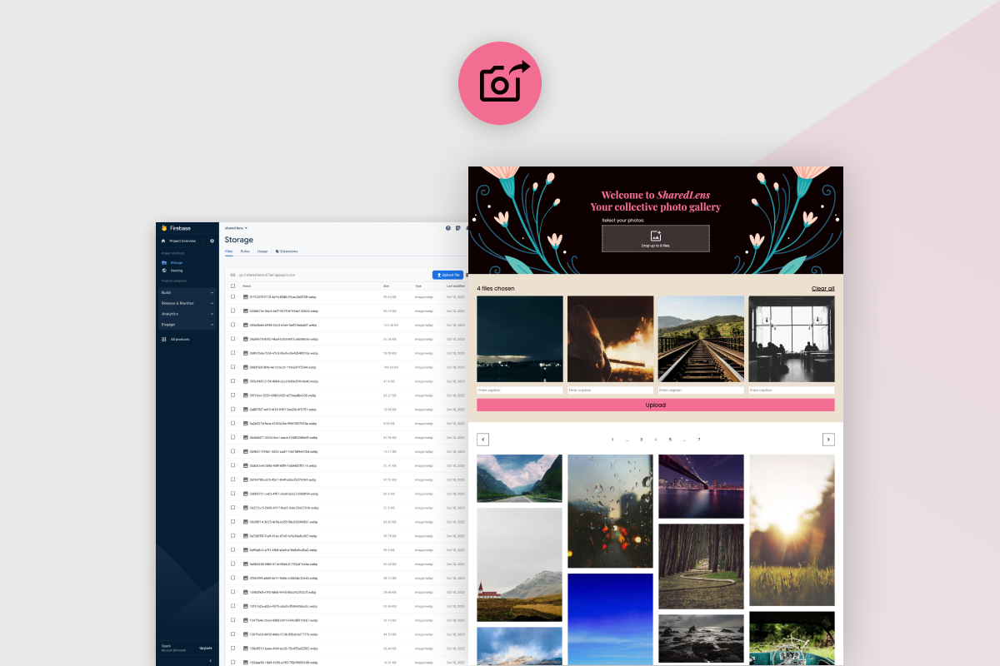

# SharedLens



## Description

SharedLens aims to provide a simple and intuitive platform for users to share their favorite photos from events like weddings, birthdays, or other special occasions. With features like image resizing for a seamless upload experience, pagination for efficient navigation, and a responsive design, SharedLens ensures an enjoyable user experience across various devices.

## Features

- **Image Upload:**
  Users can easily upload photos to the gallery, with the app supporting image resizing before upload for a better user experience.

- **Pagination:**
  The gallery is paginated, displaying a fixed number of items per page to enhance performance and navigation.

- **Responsive Design:**
  The app is designed to be responsive, ensuring a consistent user experience across different devices.

- **Loading States:**
  Various loading indicators and states are implemented to enhance user feedback during image processing and loading.

## Getting Started

Follow these steps to set up the project locally and configure Firebase for the application:

1. Clone the Repository:
    
    First, clone the repository and navigate to the project folder:

    ```
    git clone https://github.com/PictureElement/shared-lens.git
    cd shared-lens
    ```

2. Install Dependencies:

    Install the necessary dependencies for the project:

    ```
    npm install
    ```

3. Firebase Configuration:

    - Create a Firebase project and register a new web app within the project.
    - Configure Firebase Cloud Storage for the project.
    - Obtain the Firebase configuration settings for your web app.

    In the project's root directory, create a `.env.local` file, and add the Firebase configuration settings as follows:

    ```
    REACT_APP_FIREBASE_API_KEY="YOUR_API_KEY"
    REACT_APP_FIREBASE_AUTH_DOMAIN="YOUR_AUTH_DOMAIN"
    REACT_APP_FIREBASE_PROJECT_ID="YOUR_PROJECT_ID"
    REACT_APP_FIREBASE_STORAGE_BUCKET="YOUR_STORAGE_BUCKET"
    REACT_APP_FIREBASE_MESSAGING_SENDER_ID="YOUR_MESSAGING_SENDER_ID"
    REACT_APP_FIREBASE_APP_ID="YOUR_APP_ID"
    ```

4. Run the App Locally:

    Start the app in a local development environment:

    ```
    npm start
    ```

## Customization

The application provides various customization options to tailor the experience based on your preferences. You can easily adjust these configurations in the `.env` file.

- `REACT_APP_ITEMS_PER_PAGE`: Number of items to display per page.
- `REACT_APP_MAX_IMAGE_SIZE`: Maximum width or height for image resizing in pixels.
- `REACT_APP_BLOB_TYPE`: MIME type for the Blob format (e.g., image/webp, image/jpeg, image/png, etc.).
- `REACT_APP_BLOB_QUALITY`: Image quality when converting to a Blob (range: 0.0 to 1.0).
- `REACT_APP_MAX_FILE_SELECTION`: Maximum number of files that can be selected for upload.
- `REACT_APP_COLUMNS_BREAKPOINT_1`: Column count for screen width up to X pixels.
- `REACT_APP_COLUMNS_BREAKPOINT_2`: Column count for screen width between X+1 and Y pixels.
- `REACT_APP_COLUMNS_BREAKPOINT_3`: Column count for screen width greater than Y pixels.
- `REACT_APP_MASONRY_GUTTER`: Gutter value for the Masonry layout.

Additionally, the styles of the application can be customized through the `index.scss` and `App.scss` files. The codebase adheres to the Block Element Modifier (BEM) methodology, making it straightforward to make style modifications.

## Contributing

I welcome contributions! If you'd like to contribute to this project, please follow these steps:

1. Fork the repository.
2. Create a new branch for your feature or bug fix: git checkout -b feature/your-feature.
3. Make your modifications and commit them: git commit -m 'Add a new feature'.
4. Push to the branch: git push origin feature/your-feature.
5. Open a pull request.

## License

&copy; 2023 [Marios Sofokleous](https://www.msof.me/) (PictureElement). Code released under the [MIT](LICENSE.md) license.
